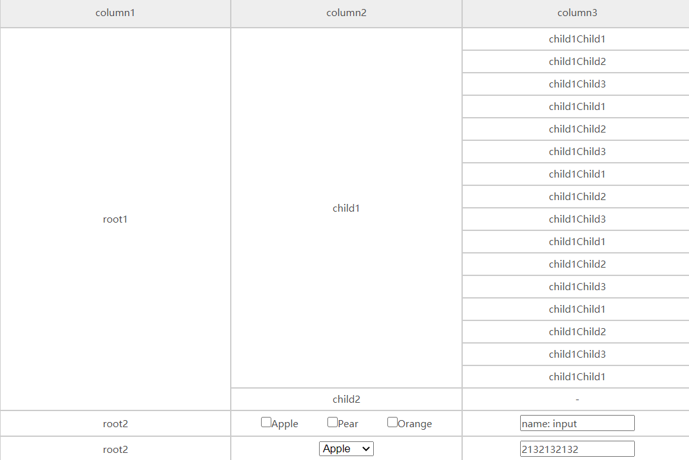

<!--
 *           佛曰:
 *                   写字楼里写字间，写字间里程序员；
 *                   程序人员写程序，又拿程序换酒钱。
 *                   酒醒只在网上坐，酒醉还来网下眠；
 *                   酒醉酒醒日复日，网上网下年复年。
 *                   但愿老死电脑间，不愿鞠躬老板前；
 *                   奔驰宝马贵者趣，公交自行程序员。
 *                   别人笑我忒疯癫，我笑自己命太贱；
 *                   不见满街漂亮妹，哪个归得程序员？
 -->

# ru-merge-cell

## description

合并单元格的表格以及操作

## install

> npm install ru-merge-cell

## 使用说明

```html
<!-- 用来包装盒子的容器 -->
<div id="container"></div>
```

```javascript
// 引入Table Table名字可以自定义
import Table from './ru-merge-cell'
// 定义表格单元格的数据
const treeData = [
  {
    name: "root1",
    key: "1",
    children: [
      {
        name: "child1",
        key: "1-1",
        children: [
          {
            name: "child1Child1",
            key: "1-1-1",
          },
          {
            name: "child1Child2",
            key: "1-1-2",
          },
          {
            name: "child1Child3",
            key: "1-1-3",
          },
          {
            name: "child1Child1",
            key: "1-1-4",
          },
          {
            name: "child1Child2",
            key: "1-1-5",
          },
          {
            name: "child1Child3",
            key: "1-1-6",
          },
          {
            name: "child1Child1",
            key: "1-1-7",
          },
          {
            name: "child1Child2",
            key: "1-1-8",
          },
          {
            name: "child1Child3",
            key: "1-1-9",
          },
          {
            name: "child1Child1",
            key: "1-1-10",
          },
          {
            name: "child1Child2",
            key: "1-1-11",
          },
          {
            name: "child1Child3",
            key: "1-1-12",
          },
          {
            name: "child1Child1",
            key: "1-1-13",
          },
          {
            name: "child1Child2",
            key: "1-1-14",
          },
          {
            name: "child1Child3",
            key: "1-1-15",
          },
          {
            name: "child1Child1",
            key: "1-1-16",
          },
          {
            name: "child1Child2",
            key: "1-1-17",
          },
          {
            name: "child1Child3",
            key: "1-1-18",
          },
          {
            name: "child1Child1",
            key: "1-1-19",
          },
          {
            name: "child1Child2",
            key: "1-1-20",
          },
          {
            name: "child1Child3",
            key: "1-1-21",
          },
        ],
      },
      {
        name: "child2",
        key: "1-2",
        children: [],
      },
    ],
  },
  {
    name: "root2",
    key: "2",
    children: [
      {
        name: "child3",
        key: "2-1",
        children: [
          {
            name: "child3child1",
            key: "2-1-1",
            children: [],
          },
        ],
      },
    ],
  },
    {
    name: "root3",
    type: 'default',
    key: "3",
    children: [
      {
        name: "",
        type: 'select',
        group: [
          { label: 'Apple', value: 'Apple' },
          { label: 'Pear', value: 'Pear' },
          { label: 'Orange', value: 'Orange' },
        ],
        value: 'Apple',
        key: "3-1",
        children: [
          {
            name: '',
            type: 'input',
            options: {
              disabled: false,
              maxlength: 10,
              minlength: 5,
            },
            value: '',
            key: '3-1-1'
          }
        ],
      },
    ],
  },
];
// 定义表格头部的数据
const columns = [
  {
    key: 0,
    title: "column1",
  },
  {
    key: 1,
    title: "column2",
  },
  {
    key: 2,
    title: "column3",
  },
];
// 定义所必需的配置项
const options = {
  container: document.getElementById("container"),
  data: treeData,
  columns,
};
// 实例化一个表格
let table = new Table(options);
```

[avatar](https://github.com/LittleBoBo-beep/tree-table/blob/main/docs/action.gif)


